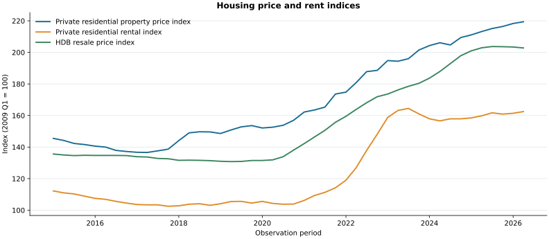
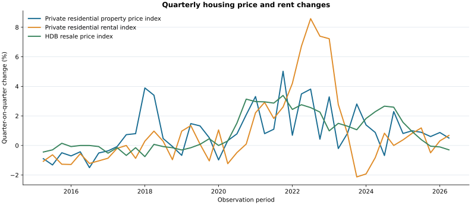
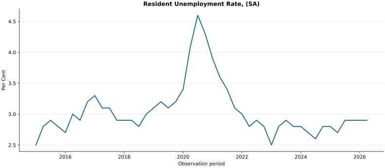
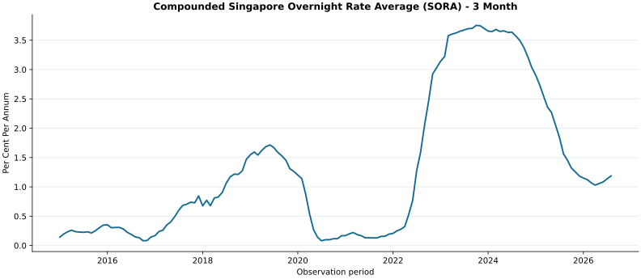
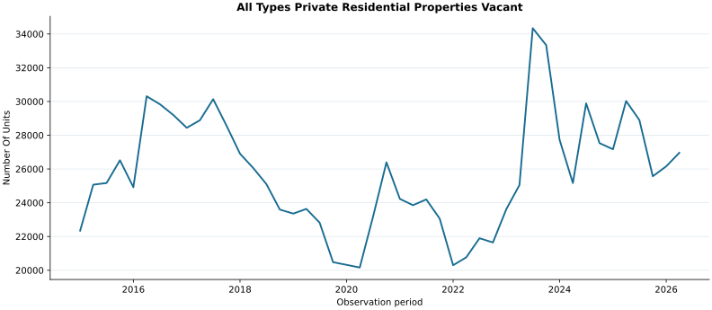
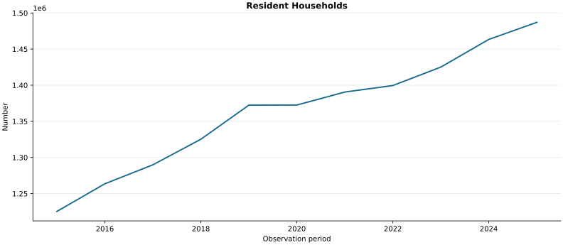
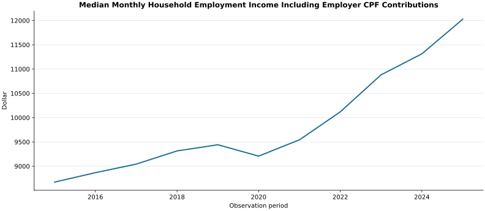
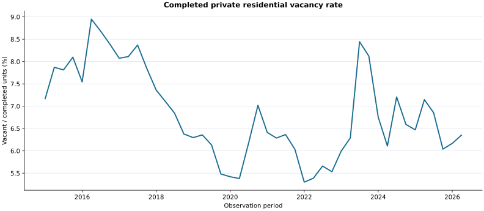

<!-- housing-report-version: 2 -->
# Singapore housing market research report

**Reporting date:** 2026-10-01  
**Run:** `english_glm_v2_reviewed_run`  
**Generated at:** 2026-10-01T14:52:55+00:00  
**Analysis mode:** Editorially reviewed presentation of english_glm_v2_run; no new model or source calls

**Data basis:** Editorial presentation of the verified original capture; no source refresh. Latest downloaded vintage filtered by observation reference date (or period end); not a historical point-in-time information set.

## Executive summary

- Private residential property price index: 219.4 Index in 2026-Q2; quarter on quarter: +0.5039 % vs 2026-Q1; year on year: +2.9081 % vs 2025-Q2.
- Private residential rental index: 162.5 Index in 2026-Q2; quarter on quarter: +0.6815 % vs 2026-Q1; year on year: +1.6896 % vs 2025-Q2.
- HDB resale price index: 202.8 Index in 2026-Q2; quarter on quarter: -0.295 % vs 2026-Q1; year on year: -0.0493 % vs 2025-Q2.

The selected dashboard contains 5 of 16 evaluated indicators. It combines observed indicator changes with explicitly bounded empirical checks; selection is not a claim that these are the best predictors.

Across 9 evaluated selected indicator/outcome pairs, the single-indicator ridge model has lower holdout MAE than historical mean in 4, last observed growth in 3, and zero growth in 8. It beats all three on 1 pair. Each comparison uses its own matching test dates; these counts do not validate the selected dashboard as a joint forecasting model.

The available latest quarter-on-quarter outcome comparisons show mixed directions. Each series retains its own reference period and market coverage; this does not establish a common cause or the next quarter's direction.

**Editorial review:** Reviewed the model wording against the captured definitions; removed unsupported scope and employment claims. 6 selection reasons were corrected and are labelled editorial_review. [Review record](selection_review.json) and [original model selection](original_selection.json) preserve the distinction. Values, selected indicators, source captures and statistical results are unchanged; this presentation makes no new API calls.

## Market outcomes

These official outcome series describe observed markets. Index levels are not currency prices and different indices should not be compared by their numeric levels.

| Outcome | Reference period | Latest index | Quarter on quarter | Year on year | Source |
|---|---|---|---|---|---|
| Private residential property price index | 2026-Q2 | 219.4 Index | +0.5039 % vs 2026-Q1 | +2.9081 % vs 2025-Q2 | [URBAN REDEVELOPMENT AUTHORITY](https://tablebuilder.singstat.gov.sg/table/TS/M212261) |
| Private residential rental index | 2026-Q2 | 162.5 Index | +0.6815 % vs 2026-Q1 | +1.6896 % vs 2025-Q2 | [URBAN REDEVELOPMENT AUTHORITY](https://tablebuilder.singstat.gov.sg/table/TS/M212311) |
| HDB resale price index | 2026-Q2 | 202.8 Index | -0.295 % vs 2026-Q1 | -0.0493 % vs 2025-Q2 | [HOUSING AND DEVELOPMENT BOARD](https://tablebuilder.singstat.gov.sg/table/TS/M212161) |

Official index base: 2009 Q1 = 100. Different market coverage; index levels are not currency prices. Display starts after the major methodology changes.

Exact previous-quarter percentage changes; no seasonally adjusted growth is implied. The statistical window uses both comparison endpoints from 2015 Q1 onward.

## Selected signals

Reference periods remain explicit: annual, quarterly and monthly observations are not silently treated as simultaneous.

| Indicator | Reference period | Latest value | Previous period | Year on year |
|---|---|---|---|---|
| Resident Unemployment Rate, (SA) | 2026-Q2 | 2.9 Per Cent | 0 percentage points vs 2026-Q1 | +0.2 percentage points vs 2025-Q2 |
| Compounded Singapore Overnight Rate Average (SORA) - 3 Month | 2026-08 | 1.1863 Per Cent Per Annum | +5.09 basis points vs 2026-07 | -37.75 basis points vs 2025-08 |
| All Types Private Residential Properties Vacant | 2026-Q2 | 26,961 Number Of Units | +3.0698 % vs 2026-Q1 | -10.2108 % vs 2025-Q2 |
| Resident Households | 2025 | 1,487,100 Number | Not available | +1.6195 % vs 2024 |
| Median Monthly Household Employment Income Including Employer CPF Contributions | 2025 | 12,027 Dollar | Not available | +6.3019 % vs 2024 |

### What the observed signals may mean

- **Resident Unemployment Rate, (SA):** The reading rose year on year. Higher unemployment may weigh on resident purchasing capacity and rent affordability.
- **Compounded Singapore Overnight Rate Average (SORA) - 3 Month:** The reading fell year on year. This may ease the benchmark component of financing costs as loans reset; mortgage spreads and the rent response remain uncertain.
- **All Types Private Residential Properties Vacant:** The reading fell year on year. The separately derived vacancy rate fell year on year; read the count with this matching-stock denominator. Vacancy does not establish active rental listings.
- **Resident Households:** The reading rose year on year. This supplies structural demand context, conditional on tenure and affordability; population or household-stock changes do not identify gross household formation.
- **Median Monthly Household Employment Income Including Employer CPF Contributions:** The reading rose year on year. This is nominal affordability context; scope, inflation, CPF treatment and household composition limit any take-home purchasing-power inference.

Source observations at their original frequency. Annual data are not interpolated into quarters or months.

Source observations at their original frequency. Annual data are not interpolated into quarters or months.

Source observations at their original frequency. Annual data are not interpolated into quarters or months.

Source observations at their original frequency. Annual data are not interpolated into quarters or months.

Source observations at their original frequency. Annual data are not interpolated into quarters or months.

### Vacancy with its denominator

The derived private residential vacancy rate is **6.35 %** in **2026-Q2**. It is calculated from matching vacant-unit and completed-stock observations, whether or not the denominator was retained in the selected dashboard.

| Comparison | Change | Base period |
|---|---|---|
| previous period | +0.1831 percentage points | 2026-Q1 |
| year on year | -0.7968 percentage points | 2025-Q2 |

Vacancy is unused completed stock, not a count of homes actively listed for letting. Public housing is outside this private-sector denominator.

Calculated from matching-quarter vacant units divided by completed private stock. Vacant units are not necessarily listed for sale or rent.

## Empirical checks

These calculations are exploratory evidence, not causal proof or a validated investment strategy. Results below cover the selected indicators; the saved research data include the full evaluated set.

The statistical window starts in **2015 Q1** to avoid spanning the major index methodology changes. Both the current and baseline observations used in a change must fall inside this window. All 16 candidates are compared with all three outcomes, including skipped results. No lag is chosen by its best observed correlation.

### Lead and lag correlations

A positive lag means the indicator precedes the housing outcome. Quarterly comparisons use quarterly outcome growth; annual comparisons use annual indicator changes and fourth-quarter year-on-year outcome growth. Annual rows are not interpolated into quarterly observations. Pearson correlation measures a linear association, and the number of paired observations is shown for every lag. Multiple comparisons can produce chance patterns.

| Indicator | Outcome | Lag units | Lag 0 outcome span | Lag 0 | Lag 1 | Lag 2 | Lag 4 |
|---|---|---|---|---|---|---|---|
| Resident Unemployment Rate, (SA) | Private residential property price index | quarters | 2016-Q1 to 2026-Q2 | -0.358 (n=42) | -0.300 (n=41) | -0.168 (n=40) | 0.029 (n=38) |
| Resident Unemployment Rate, (SA) | Private residential rental index | quarters | 2016-Q1 to 2026-Q2 | -0.519 (n=42) | -0.514 (n=41) | -0.497 (n=40) | -0.387 (n=38) |
| Resident Unemployment Rate, (SA) | HDB resale price index | quarters | 2016-Q1 to 2026-Q2 | -0.343 (n=42) | -0.185 (n=41) | -0.068 (n=40) | 0.104 (n=38) |
| Compounded Singapore Overnight Rate Average (SORA) - 3 Month | Private residential property price index | quarters | 2016-Q1 to 2026-Q2 | 0.161 (n=42) | 0.092 (n=41) | 0.055 (n=40) | -0.125 (n=38) |
| Compounded Singapore Overnight Rate Average (SORA) - 3 Month | Private residential rental index | quarters | 2016-Q1 to 2026-Q2 | 0.543 (n=42) | 0.305 (n=41) | 0.038 (n=40) | -0.349 (n=38) |
| Compounded Singapore Overnight Rate Average (SORA) - 3 Month | HDB resale price index | quarters | 2016-Q1 to 2026-Q2 | 0.080 (n=42) | 0.008 (n=41) | -0.043 (n=40) | -0.015 (n=38) |
| All Types Private Residential Properties Vacant | Private residential property price index | quarters | 2016-Q1 to 2026-Q2 | 0.000 (n=42) | 0.018 (n=41) | -0.058 (n=40) | 0.077 (n=38) |
| All Types Private Residential Properties Vacant | Private residential rental index | quarters | 2016-Q1 to 2026-Q2 | -0.166 (n=42) | -0.311 (n=41) | -0.332 (n=40) | -0.080 (n=38) |
| All Types Private Residential Properties Vacant | HDB resale price index | quarters | 2016-Q1 to 2026-Q2 | 0.120 (n=42) | 0.162 (n=41) | 0.195 (n=40) | 0.232 (n=38) |
| Resident Households | Private residential property price index | years | 2016 to 2025 | -0.363 (n=10) | -0.877 (n=9) | 0.127 (n=8) | Not estimable (n=6): Fewer than eight exact-calendar matched observations; sparse history is not scored. |
| Resident Households | Private residential rental index | years | 2016 to 2025 | -0.500 (n=10) | -0.551 (n=9) | -0.479 (n=8) | Not estimable (n=6): Fewer than eight exact-calendar matched observations; sparse history is not scored. |
| Resident Households | HDB resale price index | years | 2016 to 2025 | -0.529 (n=10) | -0.671 (n=9) | -0.265 (n=8) | Not estimable (n=6): Fewer than eight exact-calendar matched observations; sparse history is not scored. |
| Median Monthly Household Employment Income Including Employer CPF Contributions | Private residential property price index | years | 2016 to 2025 | 0.450 (n=10) | -0.323 (n=9) | -0.573 (n=8) | Not estimable (n=6): Fewer than eight exact-calendar matched observations; sparse history is not scored. |
| Median Monthly Household Employment Income Including Employer CPF Contributions | Private residential rental index | years | 2016 to 2025 | 0.504 (n=10) | -0.066 (n=9) | -0.761 (n=8) | Not estimable (n=6): Fewer than eight exact-calendar matched observations; sparse history is not scored. |
| Median Monthly Household Employment Income Including Employer CPF Contributions | HDB resale price index | years | 2016 to 2025 | 0.296 (n=10) | -0.075 (n=9) | -0.264 (n=8) | Not estimable (n=6): Fewer than eight exact-calendar matched observations; sparse history is not scored. |

### Walk-forward prediction checks

Each single-indicator model predicts next-quarter index growth from the indicator's current year-on-year change. It starts with at least **24 training pairs** and requires at least **eight subsequent test predictions**. Training expands one observation at a time. Standardization uses the training sample only; ridge penalty is fixed at one and the intercept is unpenalized. Annual candidates and short histories are explicitly skipped.

The ridge model is compared with simple baselines on the same held-out periods: historical mean growth, last observed growth and zero growth. MAE and RMSE are percentage-point errors in quarterly growth; lower is better. Direction accuracy uses negative, zero and positive changes. These are retrospective tests using the captured data vintage, not a reconstruction of releases available at each prediction date. Test windows can differ between indicators, so error magnitudes across different windows do not establish an overall ranking.

Across 9 evaluated selected indicator/outcome pairs, the single-indicator ridge model has lower holdout MAE than historical mean in 4, last observed growth in 3, and zero growth in 8. It beats all three on 1 pair. Each comparison uses its own matching test dates; these counts do not validate the selected dashboard as a joint forecasting model.

| Indicator | Outcome | Test window | Method | Test observations | MAE (pp) | RMSE (pp) | Direction accuracy |
|---|---|---|---|---|---|---|---|
| Resident Unemployment Rate, (SA) | Private residential property price index | 2022-Q2 to 2026-Q2 | ridge | 17 | 0.9435 | 1.2263 | 88.2353% |
| Resident Unemployment Rate, (SA) | Private residential property price index | 2022-Q2 to 2026-Q2 | historical mean | 17 | 1.0183 | 1.3362 | 88.2353% |
| Resident Unemployment Rate, (SA) | Private residential property price index | 2022-Q2 to 2026-Q2 | last change | 17 | 1.4731 | 1.8926 | 76.4706% |
| Resident Unemployment Rate, (SA) | Private residential property price index | 2022-Q2 to 2026-Q2 | zero change | 17 | 1.4578 | 1.8563 | 0% |
| Resident Unemployment Rate, (SA) | Private residential rental index | 2022-Q2 to 2026-Q2 | ridge | 17 | 2.1698 | 3.0775 | 70.5882% |
| Resident Unemployment Rate, (SA) | Private residential rental index | 2022-Q2 to 2026-Q2 | historical mean | 17 | 2.5261 | 3.5524 | 70.5882% |
| Resident Unemployment Rate, (SA) | Private residential rental index | 2022-Q2 to 2026-Q2 | last change | 17 | 1.3486 | 1.7541 | 64.7059% |
| Resident Unemployment Rate, (SA) | Private residential rental index | 2022-Q2 to 2026-Q2 | zero change | 17 | 2.5339 | 3.8096 | 5.8824% |
| Resident Unemployment Rate, (SA) | HDB resale price index | 2022-Q2 to 2026-Q2 | ridge | 17 | 0.9393 | 1.1079 | 82.3529% |
| Resident Unemployment Rate, (SA) | HDB resale price index | 2022-Q2 to 2026-Q2 | historical mean | 17 | 0.9818 | 1.1489 | 82.3529% |
| Resident Unemployment Rate, (SA) | HDB resale price index | 2022-Q2 to 2026-Q2 | last change | 17 | 0.446 | 0.5488 | 94.1176% |
| Resident Unemployment Rate, (SA) | HDB resale price index | 2022-Q2 to 2026-Q2 | zero change | 17 | 1.4797 | 1.7375 | 0% |
| Compounded Singapore Overnight Rate Average (SORA) - 3 Month | Private residential property price index | 2022-Q2 to 2026-Q2 | ridge | 17 | 1.0328 | 1.4012 | 88.2353% |
| Compounded Singapore Overnight Rate Average (SORA) - 3 Month | Private residential property price index | 2022-Q2 to 2026-Q2 | historical mean | 17 | 1.0183 | 1.3362 | 88.2353% |
| Compounded Singapore Overnight Rate Average (SORA) - 3 Month | Private residential property price index | 2022-Q2 to 2026-Q2 | last change | 17 | 1.4731 | 1.8926 | 76.4706% |
| Compounded Singapore Overnight Rate Average (SORA) - 3 Month | Private residential property price index | 2022-Q2 to 2026-Q2 | zero change | 17 | 1.4578 | 1.8563 | 0% |
| Compounded Singapore Overnight Rate Average (SORA) - 3 Month | Private residential rental index | 2022-Q2 to 2026-Q2 | ridge | 17 | 2.5956 | 3.5058 | 64.7059% |
| Compounded Singapore Overnight Rate Average (SORA) - 3 Month | Private residential rental index | 2022-Q2 to 2026-Q2 | historical mean | 17 | 2.5261 | 3.5524 | 70.5882% |
| Compounded Singapore Overnight Rate Average (SORA) - 3 Month | Private residential rental index | 2022-Q2 to 2026-Q2 | last change | 17 | 1.3486 | 1.7541 | 64.7059% |
| Compounded Singapore Overnight Rate Average (SORA) - 3 Month | Private residential rental index | 2022-Q2 to 2026-Q2 | zero change | 17 | 2.5339 | 3.8096 | 5.8824% |
| Compounded Singapore Overnight Rate Average (SORA) - 3 Month | HDB resale price index | 2022-Q2 to 2026-Q2 | ridge | 17 | 1.4154 | 1.6141 | 64.7059% |
| Compounded Singapore Overnight Rate Average (SORA) - 3 Month | HDB resale price index | 2022-Q2 to 2026-Q2 | historical mean | 17 | 0.9818 | 1.1489 | 82.3529% |
| Compounded Singapore Overnight Rate Average (SORA) - 3 Month | HDB resale price index | 2022-Q2 to 2026-Q2 | last change | 17 | 0.446 | 0.5488 | 94.1176% |
| Compounded Singapore Overnight Rate Average (SORA) - 3 Month | HDB resale price index | 2022-Q2 to 2026-Q2 | zero change | 17 | 1.4797 | 1.7375 | 0% |
| All Types Private Residential Properties Vacant | Private residential property price index | 2022-Q2 to 2026-Q2 | ridge | 17 | 1.0408 | 1.3993 | 88.2353% |
| All Types Private Residential Properties Vacant | Private residential property price index | 2022-Q2 to 2026-Q2 | historical mean | 17 | 1.0183 | 1.3362 | 88.2353% |
| All Types Private Residential Properties Vacant | Private residential property price index | 2022-Q2 to 2026-Q2 | last change | 17 | 1.4731 | 1.8926 | 76.4706% |
| All Types Private Residential Properties Vacant | Private residential property price index | 2022-Q2 to 2026-Q2 | zero change | 17 | 1.4578 | 1.8563 | 0% |
| All Types Private Residential Properties Vacant | Private residential rental index | 2022-Q2 to 2026-Q2 | ridge | 17 | 2.4354 | 3.3899 | 82.3529% |
| All Types Private Residential Properties Vacant | Private residential rental index | 2022-Q2 to 2026-Q2 | historical mean | 17 | 2.5261 | 3.5524 | 70.5882% |
| All Types Private Residential Properties Vacant | Private residential rental index | 2022-Q2 to 2026-Q2 | last change | 17 | 1.3486 | 1.7541 | 64.7059% |
| All Types Private Residential Properties Vacant | Private residential rental index | 2022-Q2 to 2026-Q2 | zero change | 17 | 2.5339 | 3.8096 | 5.8824% |
| All Types Private Residential Properties Vacant | HDB resale price index | 2022-Q2 to 2026-Q2 | ridge | 17 | 1.0298 | 1.2545 | 82.3529% |
| All Types Private Residential Properties Vacant | HDB resale price index | 2022-Q2 to 2026-Q2 | historical mean | 17 | 0.9818 | 1.1489 | 82.3529% |
| All Types Private Residential Properties Vacant | HDB resale price index | 2022-Q2 to 2026-Q2 | last change | 17 | 0.446 | 0.5488 | 94.1176% |
| All Types Private Residential Properties Vacant | HDB resale price index | 2022-Q2 to 2026-Q2 | zero change | 17 | 1.4797 | 1.7375 | 0% |

Some comparisons do not support this quarterly prediction check:

| Indicator | Outcome | Reason |
|---|---|---|
| Resident Households | Private residential property price index | Annual candidate: quarterly interpolation was not performed; annual associations are reported separately. |
| Resident Households | Private residential rental index | Annual candidate: quarterly interpolation was not performed; annual associations are reported separately. |
| Resident Households | HDB resale price index | Annual candidate: quarterly interpolation was not performed; annual associations are reported separately. |
| Median Monthly Household Employment Income Including Employer CPF Contributions | Private residential property price index | Annual candidate: quarterly interpolation was not performed; annual associations are reported separately. |
| Median Monthly Household Employment Income Including Employer CPF Contributions | Private residential rental index | Annual candidate: quarterly interpolation was not performed; annual associations are reported separately. |
| Median Monthly Household Employment Income Including Employer CPF Contributions | HDB resale price index | Annual candidate: quarterly interpolation was not performed; annual associations are reported separately. |

### How to use these results

Inspect sample size, data span and the baseline comparison together. A large in-sample correlation can coexist with poor held-out errors. This report does not rank a universally best predictor, assign causal weights, or turn these retrospective checks into a future price forecast.

- Latest-vintage historical analysis: revisions and historical publication availability are not reconstructed. Observation-period alignment does not prove that features were known at the forecast origin.
- No causal claim, production forecast, property-price estimate or validated investment signal is established. These indices describe aggregate markets.
- All configured candidate/outcome comparisons are retained, including skipped results. Lags and the ridge penalty were not selected by holdout performance; no best model is promoted.
- The same histories support many exploratory comparisons. Correlations have no multiple-testing adjustment or significance claim, and the holdout has not been reserved for a later untouched confirmatory test.
- Annual results use a different outcome horizon from quarterly results and must not be compared as if they were the same experiment.
- Current candidate eligibility is a data-usability screen, not evidence of historical or future predictive value.

[Research Calculations](research.json)

[All Candidate Correlations](correlations.csv)

[All Walk Forward Metrics](walk_forward_metrics.csv)

[Outcome Evidence](outcomes_evaluations.json)

## Limitations and reproducibility

- Reference dates, publication dates and retrieval dates have different meanings. Table updates do not establish historical observation-level availability.
- Later revisions may affect all retrospective statistics. A strict historical-vintage validation requires archived releases and is not claimed here.
- Each index and indicator retains its official coverage; private residential evidence is not automatically HDB evidence.
- Main-page values and comparisons are generated from saved calculations. Reasons labelled editorial_review are reviewed wording; other model-authored reasons remain qualitative judgements.
- Replay verifies saved file hashes and regenerates this report without source or model calls. A source refresh creates a new run.

## Appendix: indicator selection

Evaluated 16 candidates; selected 5. Data quality measures usability, not predictive importance. A shared family can contain complementary measures; family diversity is a preference rather than evidence of optimal prediction.

[Full indicator pool: definitions, selection reasons and official sources](indicator_pool.md) · [Searchable indicator table](indicator_pool.html)

| Candidate | Family | Latest period | Quality | Decision | Reason origin | Reason |
|---|---|---|---|---|---|---|
| Resident Population (M810001:2) | population_demand | 2026 | 100 | Excluded | model | Excluded within the population-demand family: resident population is not the number of households or homebuyers, and the household count was preferred as the more direct marker of occupied-dwelling demand. An annual headcount also cannot separate household formation or tenure shifts. Not a quality failure and not treated as fully substituted. |
| Non-Resident Population (M810001:5) | population_demand | 2026 | 100 | Excluded | model | Excluded within the population-demand family: non-resident population is rental-relevant, but metadata notes its accommodation includes arrangements beyond ordinary residential letting, and residence status can restrict ownership, so the link to sales is looser. The household-count slot was consolidated for the family. A useful supplementary rental-demand signal. |
| GDP In Chained (2015) Dollars (M015661:1) | economic_activity | 2026-Q2 | 95 | Excluded | model | Excluded on capacity: gross domestic product activity links to housing largely through jobs, incomes and confidence, which are monitored more directly by the selected labour-market and household-income signals. It belongs to a distinct family that was not filled, a channel-priority choice rather than an irrelevance or substitution claim. |
| Resident Unemployment Rate, (SA) (M182342:2) | labour_market | 2026-Q2 | 95 | Selected | model | Selected as the cyclical labour-market signal: a seasonally adjusted resident unemployment rate measured at quarter-end may speak directly to residents' purchasing capacity and willingness to commit to purchases, and to rent affordability. Complete quarterly coverage within the current window permits timely monitoring of downside stress. |
| Mean Gross Monthly Income From Employment (Including Employer CPF And Excluding Bonus) Of Employed Residents (M184101:1) | household_income | 2026-Q2 | 95 | Excluded | editorial_review | Excluded within household_income as a capacity choice. This is mean income per employed resident, including employer CPF and excluding bonus; it may proxy purchasing capacity but is not household income. Its captured history is shorter than several alternatives. The annual household median was preferred for household-level scope, with a loss of quarterly timeliness. |
| Personal Disposable Income (Nominal) (M016081:1) | household_income | 2026-Q2 | 95 | Excluded | editorial_review | Excluded within household_income as a capacity choice. Aggregate nominal personal disposable income is not income per household and can combine population and price changes with income changes. The median among resident employed households was preferred for that specific population; it is not a measure of every household or of the typical property buyer. |
| Compounded Singapore Overnight Rate Average (SORA) - 3 Month (M700071:23) | financing_cost | 2026-08 | 97.14 | Selected | model | Selected as the financing-cost signal: a compounded Singapore-dollar overnight benchmark rate is the reference for domestic floating-rate mortgage pricing, so movements may affect borrowing capacity and tenure choices for both purchases and rentals. Long continuous coverage supports monitoring across the window. |
| Consumer Loans - Housing And Bridging Loans (M701091:1.2.1) | housing_credit | 2026-08 | 97.14 | Excluded | model | Excluded from housing-credit: this is an outstanding loan stock rather than credit availability, so it partly responds to volumes and prices already embodied in the housing market, potentially creating circularity between lending and the outcomes being explained. The distinct financing-cost channel was retained instead. |
| All Types Private Residential Properties Available (M400841:1) | housing_supply | 2026-Q2 | 95 | Excluded | model | Excluded within the housing-supply family: the completed available stock is a slowly moving total, not new supply or active listings, while the vacant-unit count was preferred as the tighter slack measure, interpreted against the available-stock denominator rather than adding another selection from the same family. |
| All Types Private Residential Properties Vacant (M400841:2) | housing_supply | 2026-Q2 | 95 | Selected | model | Selected as the housing-supply slack signal: vacant completed private homes at quarter-end may indicate absorption weakness relevant to both capital values and rents, depending on demand. The count must be interpreted against the completed-stock denominator from the same source, which is not separately retained. |
| Total Non-Landed Properties (M400391:2) | housing_supply | 2026-Q2 | 95 | Excluded | editorial_review | Excluded within housing_supply as a capacity choice. This is the total non-landed private residential pipeline across development stages, not an unpurchased or unsold subset. The expectations channel may matter, but completion timing and cancellations prevent interpreting the pipeline as a completion forecast. The vacant-stock measure was preferred for current absorption context; incremental predictive value has not been established. |
| All Items (M213751:1) | inflation | 2026-08 | 97.14 | Excluded | model | Excluded: the all-items price index partially overlaps with the outcomes through its accommodation components, which risks mechanically induced rather than independently predictive variation, and its relationship to sale and rent growth is ambiguous. A related but cleaner money-rate channel is retained. |
| Resident Households (M810371:1) | population_demand | 2025 | 100 | Selected | model | Selected as the structural demand signal: the resident household count may better represent the base of dwelling demand than population alone, since households are the units that occupy homes, whether as owners or tenants. Complete annual coverage within the window. |
| Median Monthly Household Employment Income Including Employer CPF Contributions (M810361:5) | household_income | 2025 | 100 | Selected | editorial_review | Selected for affordability context among resident employed households. The household employment-income median is less sensitive to very high incomes than the mean, but it does not represent non-employed households, all households or the typical property buyer. It includes employer CPF and annual bonus allocation, is nominal, and is not take-home income. Its annual frequency limits near-term monitoring. |
| Employment (Persons) As At Year End (M183111:7) | labour_market | 2025 | 100 | Excluded | editorial_review | Excluded within labour_market as a capacity choice. Total year-end employment includes resident and non-resident employees, self-employed persons and migrant domestic workers. Some workers do not require an ordinary separate rental unit, but these data do not establish how most workers are housed or a strong correlation with GDP. Quarterly resident unemployment was preferred for resident labour-market stress; total employment remains potentially informative. |
| Total HDB Flats (M400751:1.1) | housing_supply | 2026 | 100 | Excluded | editorial_review | Excluded within housing_supply as a capacity choice. Total HDB flats are public-housing stock, not new additions. This is distinct from private-sector vacancy and may inform the HDB resale outcome; private vacancy does not fully substitute for it. The model preferred other dashboard channels, but this does not establish that HDB stock lacks explanatory or predictive value. |

## Appendix: definitions and calculation evidence

### Resident Unemployment Rate, (SA)

**Series:** `M182342:2` · **Source:** [MINISTRY OF MANPOWER](https://tablebuilder.singstat.gov.sg/table/TS/M182342)

**Definition:** Resident unemployment rate at quarter-end, seasonally adjusted; residents are citizens and permanent residents.

**Coverage:** Resident labour force, not the entire resident population or non-resident workforce.

**Frequency:** Quarterly; **Unit:** Per Cent; **Seasonal adjustment:** Seasonally Adjusted

**Observation reference date:** Period end used conservatively; **Source table updated:** 22/09/2026; **Retrieved:** 2026-10-01T14:43:27+00:00

**Feature used for empirical checks:** Year-on-year level difference in percentage points, using the exact prior-year calendar period.

| Evidence | Latest period | Base period | Formula | Latest input | Base input | Change |
|---|---|---|---|---|---|---|
| M182342:2:previous_period | 2026-Q2 | 2026-Q1 | latest_value - base_value | 2.9 | 2.9 | 0 percentage points vs 2026-Q1 |
| M182342:2:year_on_year | 2026-Q2 | 2025-Q2 | latest_value - base_value | 2.9 | 2.7 | +0.2 percentage points vs 2025-Q2 |

Raw snapshot: `raw/tabledata_M182342_48b7788b41cef5e4.json`; SHA-256 `84b73c77a3fa5e42e0f44d882ba2c465d8d7d8e426020c3f02578f7976904f27`.

### Compounded Singapore Overnight Rate Average (SORA) - 3 Month

**Series:** `M700071:23` · **Source:** [MONETARY AUTHORITY OF SINGAPORE](https://tablebuilder.singstat.gov.sg/table/TS/M700071)

**Definition:** Three-month compounded Singapore Overnight Rate Average (SORA), observed at month-end and expressed as an annual percentage rate.

**Coverage:** Singapore-dollar benchmark interest rate; not an individual mortgage offer.

**Frequency:** Monthly; **Unit:** Per Cent Per Annum; **Seasonal adjustment:** Not labelled as seasonally adjusted

**Observation reference date:** Period end used conservatively; **Source table updated:** 14/09/2026; **Retrieved:** 2026-10-01T14:43:29+00:00

**Feature used for empirical checks:** Year-on-year rate difference multiplied by one hundred, using the exact prior-year calendar period.

| Evidence | Latest period | Base period | Formula | Latest input | Base input | Change |
|---|---|---|---|---|---|---|
| M700071:23:previous_period | 2026-08 | 2026-07 | (latest_value - base_value) * 100 | 1.1863 | 1.1354 | +5.09 basis points vs 2026-07 |
| M700071:23:year_on_year | 2026-08 | 2025-08 | (latest_value - base_value) * 100 | 1.1863 | 1.5638 | -37.75 basis points vs 2025-08 |

Raw snapshot: `raw/tabledata_M700071_5ec2ab86786f7bd2.json`; SHA-256 `844467d877f0fc311402be16f7fb1e606b894eb34185683c8a20f9039d4c70a2`.

### All Types Private Residential Properties Vacant

**Series:** `M400841:2` · **Source:** [URBAN REDEVELOPMENT AUTHORITY](https://tablebuilder.singstat.gov.sg/table/TS/M400841)

**Definition:** Number of vacant completed private residential units at quarter-end, not the vacancy rate.

**Coverage:** All landed and non-landed private residential units; same exclusions and coverage as the completed stock in table M400841 row 1.

**Frequency:** Quarterly; **Unit:** Number Of Units; **Seasonal adjustment:** Not labelled as seasonally adjusted

**Observation reference date:** Period end used conservatively; **Source table updated:** 24/07/2026; **Retrieved:** 2026-10-01T14:43:30+00:00

**Feature used for empirical checks:** Year-on-year percentage change, using the exact prior-year calendar period.

| Evidence | Latest period | Base period | Formula | Latest input | Base input | Change |
|---|---|---|---|---|---|---|
| M400841:2:previous_period | 2026-Q2 | 2026-Q1 | (latest_value / base_value - 1) * 100 | 26,961 | 26,158 | +3.0698 % vs 2026-Q1 |
| M400841:2:year_on_year | 2026-Q2 | 2025-Q2 | (latest_value / base_value - 1) * 100 | 26,961 | 30,027 | -10.2108 % vs 2025-Q2 |

Raw snapshot: `raw/tabledata_M400841_de38dc09e41862f3.json`; SHA-256 `0104a610532cf4ac51fba4e4ee1eceed2f7960241c4bbf9e818ed72ec5ac8d54`.

### Resident Households

**Series:** `M810371:1` · **Source:** [SINGAPORE DEPARTMENT OF STATISTICS](https://tablebuilder.singstat.gov.sg/table/TS/M810371)

**Definition:** Annual number of resident households; household counts are distinct from population and are not the number of newly formed households.

**Coverage:** Resident households. Source estimates combine Census of Population, General Household Survey and Comprehensive June Labour Force Survey; sampling variability and source changes apply.

**Frequency:** Annual; **Unit:** Number; **Seasonal adjustment:** Not labelled as seasonally adjusted

**Observation reference date:** Period end used conservatively; **Source table updated:** 30/06/2026; **Retrieved:** 2026-10-01T14:43:32+00:00

**Feature used for empirical checks:** Year-on-year percentage change, using the exact prior-year calendar period.

| Evidence | Latest period | Base period | Formula | Latest input | Base input | Change |
|---|---|---|---|---|---|---|
| M810371:1:year_on_year | 2025 | 2024 | (latest_value / base_value - 1) * 100 | 1,487,100 | 1,463,400 | +1.6195 % vs 2024 |

Raw snapshot: `raw/tabledata_M810371_8461ccdf2c645031.json`; SHA-256 `3b1c98d7f8191a8c4ab000444fe34c827a556ab416c85e2623154d79c458595d`.

### Median Monthly Household Employment Income Including Employer CPF Contributions

**Series:** `M810361:5` · **Source:** [SINGAPORE DEPARTMENT OF STATISTICS](https://tablebuilder.singstat.gov.sg/table/TS/M810361)

**Definition:** Median nominal monthly household employment income among resident employed households, including employer CPF contributions and one-twelfth of annual bonus, before Government transfers and taxes.

**Coverage:** Households whose reference person is a citizen or permanent resident and with at least one employed member. Income sums employment and business income of employed household members, excluding live-in domestic workers.

**Frequency:** Annual; **Unit:** Dollar; **Seasonal adjustment:** Not labelled as seasonally adjusted

**Observation reference date:** Period end used conservatively; **Source table updated:** 09/02/2026; **Retrieved:** 2026-10-01T14:43:33+00:00

**Feature used for empirical checks:** Year-on-year percentage change, using the exact prior-year calendar period.

| Evidence | Latest period | Base period | Formula | Latest input | Base input | Change |
|---|---|---|---|---|---|---|
| M810361:5:year_on_year | 2025 | 2024 | (latest_value / base_value - 1) * 100 | 12,027 | 11,314 | +6.3019 % vs 2024 |

Raw snapshot: `raw/tabledata_M810361_ace929ea782b332d.json`; SHA-256 `64b079f81758a381e25fe6bc001bf4ee5057f00f4d86c542b8fbbfa85313b231`.
